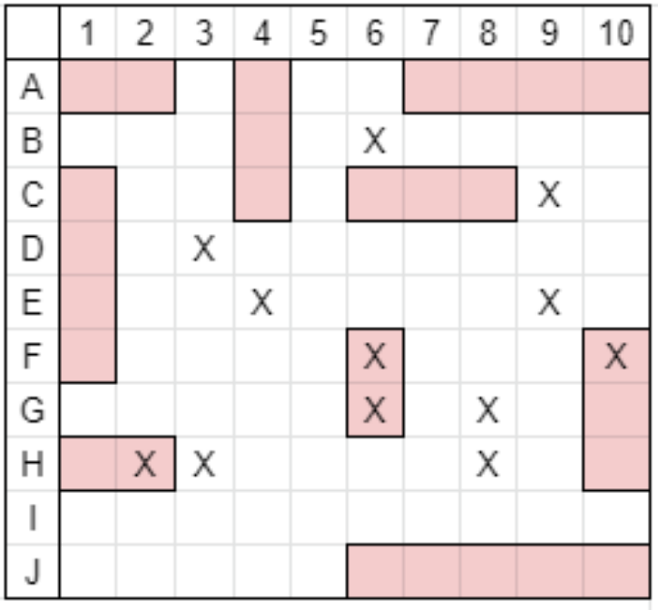
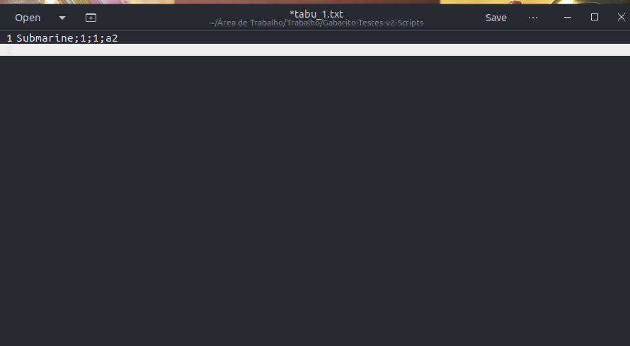
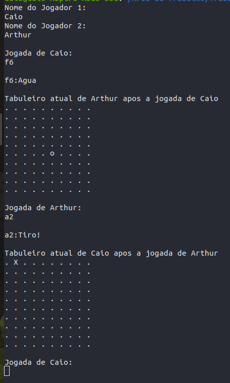
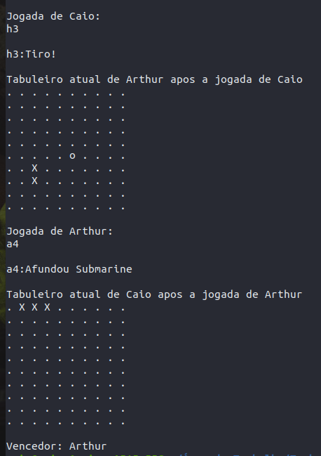

# Battleship
Battleship language c terminal game

*The game is played by two players in the terminal
*The program starts analyzing predetermined text files that compose the board of the players

*After give their names, eatch player make their moves by typing a letter and a number, representing the line and the colum of the move, respectively

*The game ends whem some player hits all the enemy ships or whem both have all your ships destroyed at the same time

